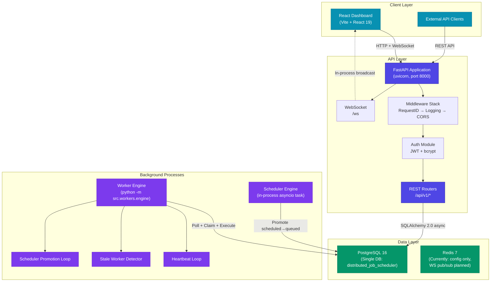

# Architecture

## High-Level Architecture Diagram

## Job Flow Diagram

```mermaid
graph LR
    Submit["Client submits job<br/>POST /queues/{id}/jobs"] --> Enqueue{"Job Type?"}
    Enqueue -->|immediate| Queued["status: queued"]
    Enqueue -->|delayed/scheduled| Scheduled["status: scheduled"]
    Enqueue -->|recurring| ScheduledCron["status: scheduled<br/>(next cron time)"]

    Scheduled -->|SchedulerEngine promotes<br/>when scheduled_at <= NOW| Queued
    ScheduledCron -->|SchedulerEngine promotes<br/>when scheduled_at <= NOW| Queued

    Queued -->|Worker claims via<br/>FOR UPDATE SKIP LOCKED| Claimed["status: claimed"]
    Claimed -->|Worker starts execution| Running["status: running"]

    Running -->|Success| Completed["status: completed"]
    Running -->|Failure| Failed["status: failed"]

    Failed -->|retry_count < max_retries| RetryScheduled["status: scheduled<br/>(with backoff delay)"]
    RetryScheduled -->|SchedulerEngine promotes| Queued

    Failed -->|retry_count >= max_retries| Dead["status: dead<br/>(→ Dead Letter Queue)"]
    Dead -->|Manual retry via API| Queued

    Completed -->|Recurring job?| NewScheduled["New job: scheduled<br/>(next cron time)"]

    classDef terminal fill:#dc2626,stroke:#b91c1c,color:#fff
    classDef active fill:#2563eb,stroke:#1d4ed8,color:#fff
    classDef success fill:#16a34a,stroke:#15803d,color:#fff

    class Dead terminal
    class Claimed,Running active
    class Completed success
```

## Component Descriptions

### Client Layer

| Component | Technology | Description |
|-----------|-----------|-------------|
| **React Dashboard** | React 19, Vite, Recharts, react-router-dom, Lucide icons | SPA that displays real-time job metrics, queue status, worker health, and DLQ entries. Connects via REST API and WebSocket (`/ws`) for live updates. |
| **External API Clients** | Any HTTP client | Can interact with all REST endpoints using JWT Bearer tokens. |

### API Layer

| Component | Technology | Description |
|-----------|-----------|-------------|
| **FastAPI Application** | FastAPI 0.115.6, Uvicorn | Application factory pattern (`create_app()`). Mounts all domain routers under `/api/v1`. OpenAPI docs at `/docs`. |
| **Middleware Stack** | Starlette BaseHTTPMiddleware | `RequestIDMiddleware` injects UUID per request (or accepts `X-Request-ID`). `RequestLoggingMiddleware` logs method, path, status, and duration via structlog. CORS configured to allow all origins (development). |
| **Auth Module** | PyJWT, passlib+bcrypt | Stateless JWT authentication. Access tokens (30min) and refresh tokens (7 days). RBAC via `require_role()` dependency. |
| **REST Routers** | FastAPI APIRouter | Domain-scoped routers for auth, organizations, projects, queues, jobs, workers, DLQ, and metrics. |
| **WebSocket** | FastAPI WebSocket | In-process `ConnectionManager` singleton broadcasts events (job:created, job:completed, worker:heartbeat, etc.) to connected dashboard clients. |

### Background Processes

| Component | Description |
|-----------|-------------|
| **Worker Engine** | Standalone process (`python -m src.workers.engine`). Self-registers, polls queues by slug, claims jobs atomically, executes with bounded concurrency via `asyncio.Semaphore`, handles SIGTERM/SIGINT for graceful shutdown (draining mode → wait for in-flight → deregister). |
| **Scheduler Engine** | Runs as an asyncio background task inside the API process (started in `lifespan`). Polls every 10 seconds for scheduled jobs where `scheduled_at <= NOW()` and promotes them to `queued` using `FOR UPDATE SKIP LOCKED`. |
| **Heartbeat Loop** | Inside Worker Engine. Sends heartbeats every 30 seconds with active job count, CPU usage, and memory usage. |
| **Stale Worker Detector** | Inside Worker Engine. Runs every 60 seconds. If a worker's last heartbeat exceeds `WORKER_STALE_THRESHOLD` (90s), marks it offline and re-queues its orphaned jobs. |
| **Scheduler Promotion Loop** | Inside Worker Engine (redundant with the API-side `SchedulerEngine`). Also promotes due scheduled jobs every 5 seconds. |

### Data Layer

| Component | Technology | Description |
|-----------|-----------|-------------|
| **PostgreSQL 16** | asyncpg + SQLAlchemy 2.0 async | Single database for all data. Connection pool: 20 connections + 10 overflow. `pool_pre_ping=True` for connection validation. Alembic for migrations. |
| **Redis 7** | redis-py 5.2.1 | Listed as a dependency and provisioned in docker-compose, but currently only used for configuration. The WebSocket broadcast uses in-process pub/sub. Redis pub/sub is noted as a future enhancement for multi-process broadcasting. |

## Design Trade-offs

### Polling vs. Push for Job Dispatch

**Decision: Polling.** Workers poll queues at a configurable interval (`WORKER_POLL_INTERVAL`, default 1 second). Each poll cycle uses `SELECT ... FOR UPDATE SKIP LOCKED` to claim jobs atomically.

- **Why polling:** Simpler architecture — workers are stateless consumers that don't need a persistent connection to a message broker. PostgreSQL handles all serialization. No separate queue infrastructure required.
- **Trade-off:** Slightly higher latency (up to `poll_interval` seconds) compared to push-based systems. More database load from empty polls when queues are idle.

### Single Database vs. Separate Queue Store

**Decision: Single PostgreSQL database for everything** — user data, job metadata, queue state, execution history, DLQ, and worker heartbeats.

- **Why:** Simplifies deployment and transactional consistency. Job claiming, status updates, and DLQ insertion happen in the same transaction without distributed coordination.
- **Trade-off:** PostgreSQL handles the write-heavy workload of job claiming (mitigated by `SKIP LOCKED` eliminating contention). At very high scale (>10K jobs/sec), a dedicated queue store (Redis Streams, RabbitMQ) would offload the hot path.

### In-Process WebSocket vs. Redis Pub/Sub

**Decision: In-process `ConnectionManager`** with plans for Redis pub/sub noted in code comments.

- **Why:** Sufficient for single-instance deployment. Zero additional infrastructure.
- **Trade-off:** WebSocket events are only visible to clients connected to the same API instance. Multi-instance deployment requires Redis pub/sub (not yet implemented).

### Scheduler Location (API vs. Worker)

**Decision: Both.** The `SchedulerEngine` runs inside the API process, and the Worker Engine has its own `_scheduler_promotion_loop`.

- **Why:** Redundancy — scheduled jobs get promoted even if one process restarts. Both use `FOR UPDATE SKIP LOCKED` to avoid double-promotion.
- **Trade-off:** Slight complexity from dual promotion paths. In production, you'd pick one authoritative scheduler.
