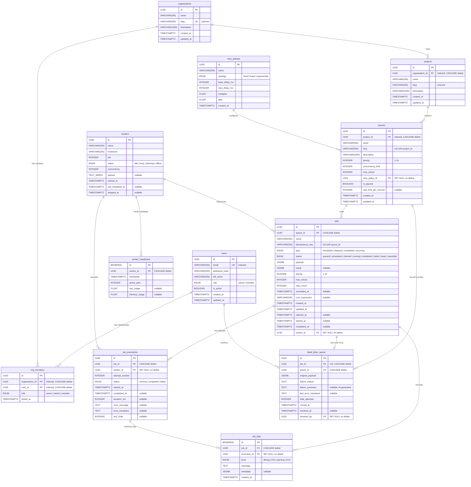

# ER Diagram

## Entity-Relationship Diagram

## Table Details

### users

| Column | Type | Constraints | Notes |
|--------|------|-------------|-------|
| `id` | UUID | PK, default `uuid4()` | |
| `email` | VARCHAR(255) | UNIQUE, NOT NULL, **indexed** | |
| `password_hash` | VARCHAR(255) | NOT NULL | bcrypt hash |
| `full_name` | VARCHAR(255) | NOT NULL | |
| `role` | ENUM(`admin`, `member`) | NOT NULL, default `member` | DB-level constraint `user_role` |
| `is_active` | BOOLEAN | NOT NULL, default `true` | |
| `created_at` | TIMESTAMPTZ | NOT NULL, server default `now()` | |
| `updated_at` | TIMESTAMPTZ | NOT NULL, server default `now()`, onupdate `now()` | |

---

### organizations

| Column | Type | Constraints | Notes |
|--------|------|-------------|-------|
| `id` | UUID | PK | |
| `name` | VARCHAR(255) | NOT NULL | |
| `slug` | VARCHAR(255) | UNIQUE, NOT NULL, **indexed** | URL-friendly identifier |
| `description` | VARCHAR(1000) | NOT NULL, default `""` | |
| `created_at` | TIMESTAMPTZ | NOT NULL, server default `now()` | |
| `updated_at` | TIMESTAMPTZ | NOT NULL, server default `now()`, onupdate `now()` | |

---

### org_members

| Column | Type | Constraints | Notes |
|--------|------|-------------|-------|
| `id` | UUID | PK | |
| `organization_id` | UUID | FK → `organizations.id` ON DELETE CASCADE, **indexed** | |
| `user_id` | UUID | FK → `users.id` ON DELETE CASCADE, **indexed** | |
| `role` | ENUM(`owner`, `admin`, `member`) | NOT NULL, default `member` | DB-level constraint `org_member_role` |
| `joined_at` | TIMESTAMPTZ | NOT NULL, server default `now()` | |

**Unique constraint:** `uq_org_member(organization_id, user_id)` — a user can only be in an org once.

---

### projects

| Column | Type | Constraints | Notes |
|--------|------|-------------|-------|
| `id` | UUID | PK | |
| `organization_id` | UUID | FK → `organizations.id` ON DELETE CASCADE, **indexed** | |
| `name` | VARCHAR(255) | NOT NULL | |
| `slug` | VARCHAR(255) | NOT NULL, **indexed** | |
| `description` | VARCHAR(1000) | NOT NULL, default `""` | |
| `created_at` | TIMESTAMPTZ | NOT NULL, server default `now()` | |
| `updated_at` | TIMESTAMPTZ | NOT NULL, server default `now()`, onupdate `now()` | |

Note: Slug uniqueness within an organization is enforced at the application level (service layer check), not as a DB composite unique constraint.

---

### retry_policies

| Column | Type | Constraints | Notes |
|--------|------|-------------|-------|
| `id` | UUID | PK | |
| `name` | VARCHAR(255) | NOT NULL | |
| `strategy` | ENUM(`fixed`, `linear`, `exponential`) | NOT NULL, default `exponential` | DB-level constraint `retry_strategy` |
| `base_delay_ms` | INTEGER | NOT NULL, default `1000` | |
| `max_delay_ms` | INTEGER | NOT NULL, default `300000` (5 min) | |
| `multiplier` | FLOAT | NOT NULL, default `2.0` | |
| `jitter` | FLOAT | NOT NULL, default `0.2` (±20%) | |
| `created_at` | TIMESTAMPTZ | NOT NULL, server default `now()` | |

---

### queues

| Column | Type | Constraints | Notes |
|--------|------|-------------|-------|
| `id` | UUID | PK | |
| `project_id` | UUID | FK → `projects.id` ON DELETE CASCADE, **indexed** | |
| `name` | VARCHAR(255) | NOT NULL | |
| `slug` | VARCHAR(255) | NOT NULL | |
| `description` | VARCHAR(1000) | NOT NULL, default `""` | |
| `priority` | INTEGER | NOT NULL, default `5` | 1–10 scale |
| `concurrency_limit` | INTEGER | NOT NULL, default `10` | |
| `max_retries` | INTEGER | NOT NULL, default `3` | |
| `retry_policy_id` | UUID | FK → `retry_policies.id` ON DELETE SET NULL, nullable | |
| `is_paused` | BOOLEAN | NOT NULL, default `false` | |
| `rate_limit_per_second` | INTEGER | nullable | |
| `created_at` | TIMESTAMPTZ | NOT NULL, server default `now()` | |
| `updated_at` | TIMESTAMPTZ | NOT NULL, server default `now()`, onupdate `now()` | |

**Indexes:**
- `uq_queue_project_slug(project_id, slug)` — composite unique
- `ix_queue_active_priority(is_paused, priority)` — for finding active queues by priority

---

### jobs

| Column | Type | Constraints | Notes |
|--------|------|-------------|-------|
| `id` | UUID | PK | |
| `queue_id` | UUID | FK → `queues.id` ON DELETE CASCADE | |
| `name` | VARCHAR(255) | NOT NULL, default `"untitled"` | |
| `idempotency_key` | VARCHAR(255) | nullable | |
| `type` | ENUM(`immediate`, `delayed`, `scheduled`, `recurring`) | NOT NULL, default `immediate` | |
| `status` | ENUM(`queued`, `scheduled`, `claimed`, `running`, `completed`, `failed`, `dead`, `cancelled`) | NOT NULL, default `queued` | |
| `payload` | JSONB | NOT NULL, default `{}` | |
| `result` | JSONB | nullable | |
| `priority` | INTEGER | NOT NULL, default `5` | 1–10 scale |
| `max_retries` | INTEGER | NOT NULL, default `3` | |
| `retry_count` | INTEGER | NOT NULL, default `0` | |
| `scheduled_at` | TIMESTAMPTZ | nullable | |
| `cron_expression` | VARCHAR(100) | nullable | |
| `created_at` | TIMESTAMPTZ | NOT NULL, server default `now()` | |
| `updated_at` | TIMESTAMPTZ | NOT NULL, server default `now()`, onupdate `now()` | |
| `claimed_at` | TIMESTAMPTZ | nullable | |
| `started_at` | TIMESTAMPTZ | nullable | |
| `completed_at` | TIMESTAMPTZ | nullable | |
| `worker_id` | UUID | FK → `workers.id` ON DELETE SET NULL, nullable | |

**Indexes:**
- `ix_job_claim_path(queue_id, status, priority, created_at)` — **THE hot path index** for the atomic claim query
- `ix_job_scheduled_due(scheduled_at)` — partial index: `WHERE status = 'scheduled'`
- `ix_job_queue_status(queue_id, status)` — for listing jobs by queue with status filter

**Unique constraint:** `uq_job_idempotency_key_queue(idempotency_key, queue_id)` — idempotency key is unique per queue, not globally

---

### job_executions

| Column | Type | Constraints | Notes |
|--------|------|-------------|-------|
| `id` | UUID | PK | |
| `job_id` | UUID | FK → `jobs.id` ON DELETE CASCADE | |
| `worker_id` | UUID | FK → `workers.id` ON DELETE SET NULL, nullable | |
| `attempt_number` | INTEGER | NOT NULL, default `1` | |
| `status` | ENUM(`running`, `completed`, `failed`) | NOT NULL, default `running` | |
| `started_at` | TIMESTAMPTZ | NOT NULL, server default `now()` | |
| `completed_at` | TIMESTAMPTZ | nullable | |
| `duration_ms` | INTEGER | nullable | |
| `error_message` | TEXT | nullable | |
| `error_traceback` | TEXT | nullable | |
| `exit_code` | INTEGER | nullable | |

**Indexes:**
- `ix_execution_job_attempt(job_id, attempt_number)`

---

### job_logs

| Column | Type | Constraints | Notes |
|--------|------|-------------|-------|
| `id` | BIGSERIAL | PK, autoincrement | BIGINT for high-throughput writes |
| `job_id` | UUID | FK → `jobs.id` ON DELETE CASCADE | |
| `execution_id` | UUID | FK → `job_executions.id` ON DELETE SET NULL, nullable | |
| `level` | ENUM(`debug`, `info`, `warning`, `error`) | NOT NULL, default `info` | |
| `message` | TEXT | NOT NULL | |
| `metadata` | JSONB | nullable | Column named `metadata` in DB, mapped as `metadata_` in Python |
| `created_at` | TIMESTAMPTZ | NOT NULL, server default `now()` | |

**Indexes:**
- `ix_job_log_job_created(job_id, created_at)` — for fetching logs in chronological order per job

---

### workers

| Column | Type | Constraints | Notes |
|--------|------|-------------|-------|
| `id` | UUID | PK | |
| `name` | VARCHAR(255) | NOT NULL | Format: `worker-{hostname}-{pid}` |
| `hostname` | VARCHAR(255) | NOT NULL | |
| `pid` | INTEGER | NOT NULL | |
| `status` | ENUM(`idle`, `busy`, `draining`, `offline`) | NOT NULL, default `idle` | |
| `concurrency` | INTEGER | NOT NULL, default `10` | |
| `queues` | TEXT[] (ARRAY) | nullable | Queue slugs this worker listens to |
| `started_at` | TIMESTAMPTZ | NOT NULL, server default `now()` | |
| `last_heartbeat_at` | TIMESTAMPTZ | nullable | |
| `stopped_at` | TIMESTAMPTZ | nullable | |

**Indexes:**
- `ix_worker_active(status)` — partial index: `WHERE status != 'offline'`

---

### worker_heartbeats

| Column | Type | Constraints | Notes |
|--------|------|-------------|-------|
| `id` | BIGSERIAL | PK, autoincrement | BIGINT for time-series data |
| `worker_id` | UUID | FK → `workers.id` ON DELETE CASCADE | |
| `timestamp` | TIMESTAMPTZ | NOT NULL, server default `now()` | |
| `active_jobs` | INTEGER | NOT NULL, default `0` | |
| `cpu_usage` | FLOAT | nullable | |
| `memory_usage` | FLOAT | nullable | |

**Indexes:**
- `ix_heartbeat_worker_time(worker_id, timestamp)`

---

### dead_letter_queue

| Column | Type | Constraints | Notes |
|--------|------|-------------|-------|
| `id` | UUID | PK | |
| `job_id` | UUID | FK → `jobs.id` ON DELETE CASCADE, **UNIQUE** | One DLQ entry per job |
| `queue_id` | UUID | FK → `queues.id` ON DELETE CASCADE | |
| `original_payload` | JSONB | NOT NULL | Preserved original (jobs may be modified on retry) |
| `failure_reason` | TEXT | NOT NULL | |
| `failure_summary` | TEXT | nullable | Pattern-based classification with actionable suggestions |
| `last_error_traceback` | TEXT | nullable | |
| `total_attempts` | INTEGER | NOT NULL, default `0` | |
| `moved_at` | TIMESTAMPTZ | NOT NULL, server default `now()` | |
| `resolved_at` | TIMESTAMPTZ | nullable | |
| `resolved_by` | UUID | FK → `users.id` ON DELETE SET NULL, nullable | |

**Indexes:**
- `ix_dlq_queue_moved(queue_id, moved_at)` — for listing DLQ entries per queue
- `ix_dlq_unresolved(resolved_at)` — partial index: `WHERE resolved_at IS NULL`

---

## Normalization Decisions

- **3NF throughout.** No denormalized counters — counts (member_count, queue_count, active_job_count) are computed at query time via aggregation.
- **RetryPolicy is a separate entity** (not embedded in Queue) so policies can be reused across multiple queues.
- **OrgMember as a join table** with its own UUID PK and a composite unique constraint, allowing membership-level roles independent of the user's global role.
- **JobExecution is separate from Job** (1-to-many) to preserve the full audit trail of every attempt. Each retry creates a new execution record.
- **JobLog is append-only** with BIGSERIAL PK for efficient sequential insertion at high throughput.
- **WorkerHeartbeat is a separate time-series table** rather than updating a column on Worker, preserving historical metrics.

## Cascading Behavior Summary

| Parent | Child | On Delete |
|--------|-------|-----------|
| `organizations` | `org_members` | CASCADE |
| `organizations` | `projects` | CASCADE |
| `users` | `org_members` | CASCADE |
| `projects` | `queues` | CASCADE |
| `queues` | `jobs` | CASCADE |
| `queues` | `dead_letter_queue` | CASCADE |
| `jobs` | `job_executions` | CASCADE |
| `jobs` | `job_logs` | CASCADE |
| `jobs` | `dead_letter_queue` | CASCADE |
| `job_executions` | `job_logs` (via execution_id) | SET NULL |
| `retry_policies` | `queues` (via retry_policy_id) | SET NULL |
| `workers` | `jobs` (via worker_id) | SET NULL |
| `workers` | `job_executions` (via worker_id) | SET NULL |
| `workers` | `worker_heartbeats` | CASCADE |
| `users` | `dead_letter_queue` (via resolved_by) | SET NULL |

Deleting an organization cascades through projects → queues → jobs → executions → logs, cleaning up the entire hierarchy. Worker and retry policy references use SET NULL to preserve job history even after worker deregistration or policy deletion.
